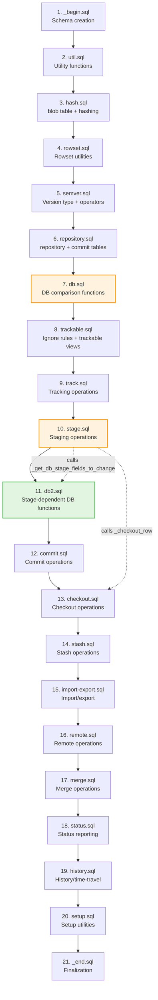
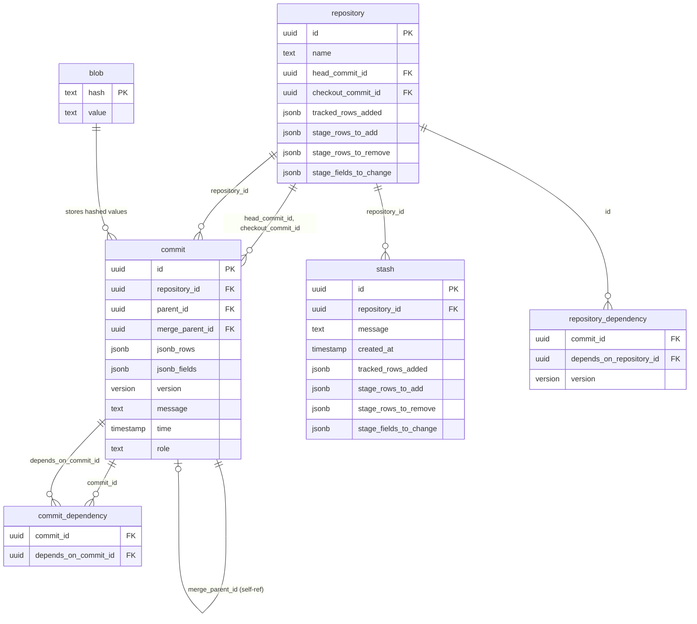
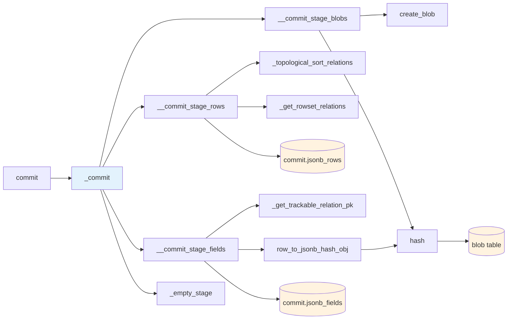
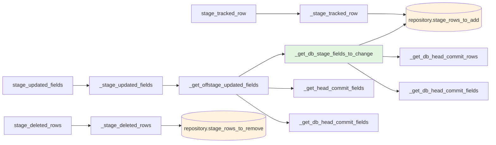
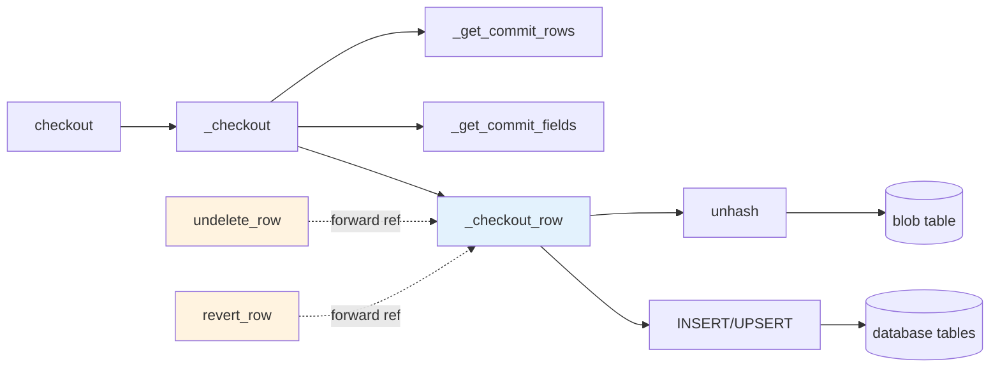
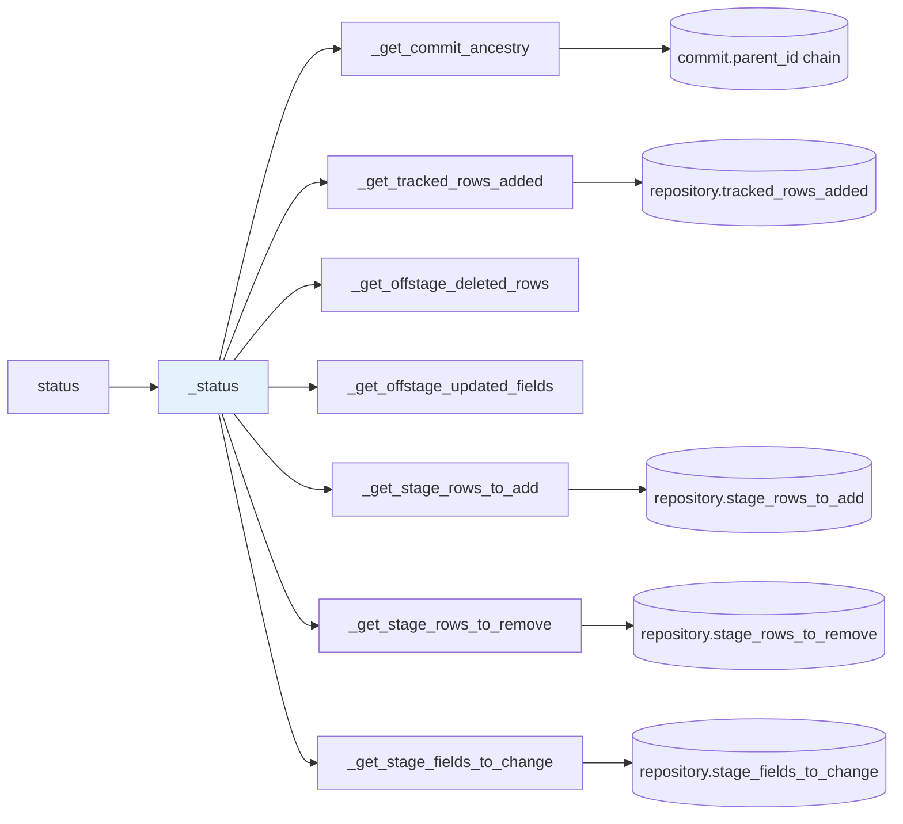

# Bundle SQL Dependency Graph

This document provides a visual representation of the dependencies between SQL files, tables, and functions in the bundle module.

## Overview

The bundle module is a PostgreSQL-based version control system for database data. It provides git-like functionality including commits, checkout, staging, stashing, and history tracking.

**Total Files:** 21 SQL files
**Total Objects:** ~200+ functions, ~10 tables, ~10 views, custom types and operators
**Lines of Code:** ~6,500 lines

---

## File Load Order with Cross-File Dependencies

This diagram shows the load order defined in `files.mk` and highlights critical cross-file dependencies.



**Legend:**
- **Green (db2.sql):** Stage-dependent functions - loads after stage.sql
- **Orange (stage.sql, db.sql):** Files with cross-file dependencies
- **Dotted arrows:** Forward references resolved at runtime

---

## Table Dependency Graph

Core tables and their relationships with foreign key constraints.



**Key Relationships:**
- `repository.head_commit_id` → `commit.id` (current version)
- `repository.checkout_commit_id` → `commit.id` (working directory state)
- `commit.parent_id` → `commit.id` (forms commit history chain)
- All relationships have `ON DELETE CASCADE` for cleanup

---

## Function Call Chains

### Commit Operation Flow



### Stage Operation Flow



**Note:** `_get_db_stage_fields_to_change` is in `db2.sql` (green) which loads after `stage.sql`, resolving the dependency chain correctly.

### Checkout Operation Flow



**Note:** `undelete_row` and `revert_row` in `stage.sql` call `_checkout_row` from `checkout.sql` (forward reference marked with dotted line).

### Status Operation Flow



---

## Critical Objects by File

<details>
<summary><b>hash.sql</b> - Blob storage and hashing</summary>

**Tables:**
- `blob` - Stores hashed values for deduplication

**Functions:**
- `hash(text) → text` - SHA256 hashing
- `unhash(text) → text` - Retrieve value from blob
- `create_blob(text) → boolean` - Store hashed value
- `row_to_jsonb_hash_obj(record, ...) → jsonb` - Hash all fields in a row

**Dependencies:** None
**Used by:** All modules that store/retrieve data

</details>

<details>
<summary><b>repository.sql</b> - Core version control tables</summary>

**Tables:**
- `repository` - Repository metadata
- `commit` - Commit snapshots
- `repository_dependency` - Version dependencies
- `commit_dependency` - Commit relationships

**Types:**
- `field_hash` - (field_id, value_hash)

**Functions (25):**
- `create_repository(text) → uuid`
- `delete_repository(text) → void`
- `repository_id(text) → uuid`
- `head_commit_id(text) → uuid`
- `_get_commit_rows(uuid, ...)`
- `_get_commit_fields(uuid)`
- Plus 19 more repository management functions

**Dependencies:**
- meta schema types (row_id, field_id, etc.)

**Used by:** All bundle modules

</details>

<details>
<summary><b>stage.sql</b> - Staging area operations</summary>

**Types:**
- `field_hash_diff` - Field difference tracking
- `stage_row` - (row_id, new_row boolean)

**Views:**
- `stage_row_to_add`
- `stage_row_to_remove`
- `stage_field_to_change`

**Functions (28):**
- `stage_tracked_row(text, meta.row_id)`
- `unstage_tracked_row(text, meta.row_id)`
- `stage_row_to_remove(text, meta.row_id)`
- `stage_updated_fields(text, ...)`
- `stage_deleted_rows(text, ...)`
- `empty_stage(text) → void`
- `undelete_row(uuid, meta.row_id)` - **Calls checkout.sql functions**
- `revert_row(uuid, meta.row_id)` - **Calls checkout.sql functions**
- Plus 20 more staging functions

**Dependencies:**
- repository.sql (repository, commit tables)
- db.sql (DB comparison functions)
- db2.sql (`_get_db_stage_fields_to_change`)
- checkout.sql (`_checkout_row` - forward reference)

**Used by:** commit.sql, status.sql

</details>

<details>
<summary><b>db2.sql</b> - Stage-dependent database functions</summary>

**Purpose:** Functions that depend on stage.sql being loaded first.

**Functions (4):**
- `_get_db_stage_rows_added(uuid)` - Wraps `repository.stage_rows_to_add` with existence check
- `_get_db_stage_fields_to_change(uuid, ...)` - Compares staged fields to DB/commit state
- `_get_db_offstage_updated_fields(uuid, ...)` - Wraps `_get_offstage_updated_fields` with existence check
- `_get_db_stage_rows_to_remove(uuid)` - Wraps `_get_stage_rows_to_remove` with existence check

**Dependencies:**
- stage.sql (must load first)
- db.sql (DB comparison base functions)

**Used by:** stage.sql, status.sql

**Note:** This file exists specifically to break circular dependencies between db.sql and stage.sql.

</details>

<details>
<summary><b>commit.sql</b> - Commit operations</summary>

**Types:**
- `_commit_ancestor` - Commit ancestry info
- `schema_edge` - Foreign key edge

**Functions (11):**
- `commit(text, text, text, ...) → uuid` - Public API
- `_commit(uuid, text, text, ...) → uuid` - Main implementation
- `__commit_stage_blobs(uuid, uuid, uuid)` - Store blob hashes
- `__commit_stage_rows(uuid, uuid, uuid)` - Store row snapshots
- `__commit_stage_fields(uuid, uuid, uuid, ...)` - Store field hashes
- `_commit_log(uuid)` - Get commit history
- `_topological_sort_relations(relation_id[])` - Order tables by FK dependencies
- `analyze_stage_deps(uuid)` - Analyze staged dependencies

**Dependencies:**
- repository.sql (commit table)
- stage.sql (staging functions)
- hash.sql (create_blob)

**Used by:** All version control operations

</details>

<details>
<summary><b>checkout.sql</b> - Checkout operations</summary>

**Functions (5):**
- `checkout(text, boolean) → void` - Public API
- `_checkout(uuid, boolean) → text` - Main implementation
- `_checkout_row(meta.row_id, jsonb, boolean)` - Restore single row
- `delete_checkout(text) → void` - Remove checkout

**Dependencies:**
- repository.sql (checkout_commit_id)
- hash.sql (unhash)

**Used by:**
- stage.sql (`undelete_row`, `revert_row` - forward reference)
- Version control workflows

</details>

<details>
<summary><b>stash.sql</b> - Stash operations</summary>

**Tables:**
- `stash` - Stores uncommitted changes

**Types:**
- `stash_field_value` - (field_id, value)

**Functions (16):**
- `stash(uuid, text)` - Save uncommitted changes
- `stash_pop(text, uuid, boolean)` - Apply and remove stash
- `stash_apply(text, uuid, boolean)` - Apply stash without removing
- `stash_list(text)` - List stashes
- `stash_show(text, uuid)` - Show stash contents
- Plus 11 more stash operations

**Dependencies:**
- repository.sql (repository table)
- stage.sql (staging functions)

</details>

<details>
<summary><b>history.sql</b> - Time-travel operations</summary>

**Functions (12):**
- `get_row_at_commit(text, meta.row_id)` - Get row state at commit
- `get_rows_at_commit(text, meta.relation_id)` - Get all rows at commit
- `get_field_at_commit(text, meta.field_id)` - Get field value at commit
- `_get_row_change_ancestry(uuid, meta.row_id)` - Track row changes through history
- Plus 8 more history functions

**Dependencies:**
- repository.sql (commit table)
- hash.sql (unhash)

</details>

<details>
<summary><b>status.sql</b> - Status reporting</summary>

**Types:**
- `row_state` enum - tracked | staged | in_commit

**Functions (4):**
- `status(text, boolean) → text` - Generate status report
- `_status(uuid)` - Implementation
- `_get_commit_status(uuid)` - Commit-specific status
- `_get_row_ancestry(uuid)` - Row history

**Dependencies:**
- repository.sql
- stage.sql
- commit.sql
- db2.sql

</details>

---

## Resolved Issues

### Issue 1: Duplicate Function (FIXED)
**Before:** `_get_db_stage_fields_to_change()` was defined in both `db.sql` (lines 333-366) and `db2.sql` (lines 16-49).

**After:** Duplicate removed from `db.sql`. Function now exists only in `db2.sql` where it belongs (stage-dependent functions).

### Issue 2: Circular Dependency (RESOLVED)
**Before:** `stage.sql` called `_get_db_stage_fields_to_change()` from `db2.sql` which loads after `stage.sql`. The duplicate in `db.sql` accidentally resolved this but was confusing.

**After:** With the duplicate removed, the function is only in `db2.sql`. Stage.sql functions that need it will work correctly because PostgreSQL resolves function calls at execution time, not definition time.

### Issue 3: Forward References (DOCUMENTED)
**Before:** `undelete_row()` and `revert_row()` in `stage.sql` called `_checkout_row()` from `checkout.sql` without documentation.

**After:** Added clear comments explaining these forward references are safe because PostgreSQL resolves function calls at runtime.

---

## Architecture Summary

### Data Flow

1. **Modify database** → Working directory changes
2. **Track rows** → Add to `repository.tracked_rows_added`
3. **Stage changes** → Move to `repository.stage_rows_to_add/remove/fields_to_change`
4. **Commit** → Snapshot to `commit.jsonb_rows/fields`, store hashes in `blob`
5. **Checkout** → Restore from `commit` via `unhash()` from `blob`

### Key Design Patterns

1. **Content-addressable storage:** All values hashed and deduplicated in `blob` table
2. **JSONB storage:** Commits store row/field IDs and hashes, not actual data
3. **Three-stage model:** Working directory → Stage → Commit (like git)
4. **Lazy loading:** Functions resolve dependencies at runtime, allowing forward references
5. **Cascade deletes:** Deleting repository removes all commits, stashes, dependencies

### File Organization Principles

1. **Foundation files first:** Types, utilities, core tables
2. **Dependencies before dependents:** Base functions before wrappers
3. **db2.sql exception:** Late-loading file for functions that need stage.sql
4. **Forward references allowed:** PostgreSQL resolves functions at runtime

---

## Maintenance Notes

### When Adding New Functions

1. **Determine dependencies:** What tables/functions does it use?
2. **Choose file location:**
   - Does it depend on stage.sql? → Consider db2.sql
   - Is it core functionality? → Add to repository.sql
   - Is it a wrapper? → Add near the wrapped function
3. **Check load order:** Ensure dependencies load before dependents
4. **Document forward references:** If unavoidable, add clear comments

### When Modifying Load Order

1. Review cross-file dependencies in this document
2. Check for circular dependencies
3. Run full test suite after changes
4. Update this documentation

### Testing Changes

```bash
# Build bundle
make bundle--0.6.sql

# Run tests
make test

# Check for duplicate functions
grep -n "create or replace function" *.sql | sort | uniq -d

# Verify function count in database
psql -c "SELECT count(*) FROM pg_proc WHERE pronamespace = 'bundle'::regnamespace"
```

---

**Last Updated:** 2026-01-14
**Bundle Version:** 0.6
**Files Analyzed:** 21 SQL files, 6,500+ lines of code
